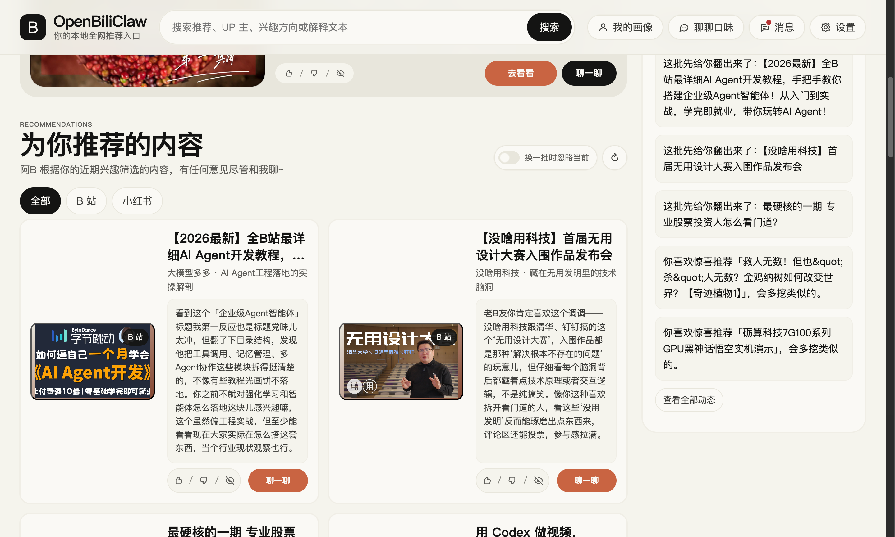
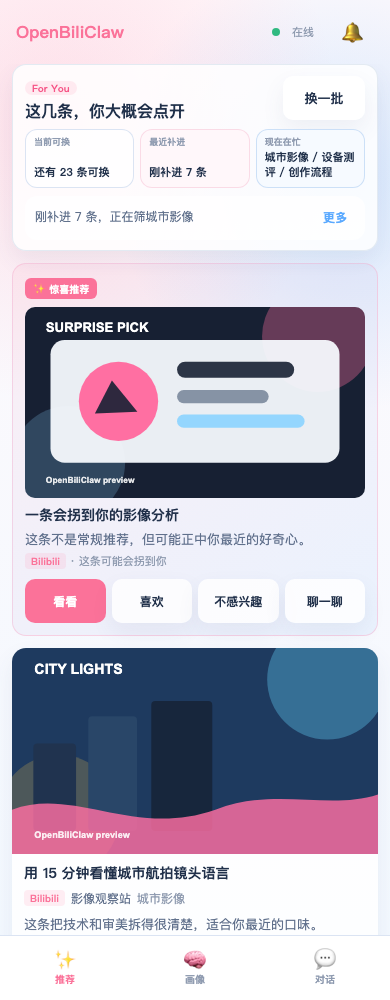

# 我做了一个“先理解人，再找内容”的本地推荐 Agent

我们每天都在被推荐算法喂内容。

它们越来越准，也越来越让人有点不安。

不是因为推荐系统不聪明。恰恰相反，今天的平台推荐已经非常聪明：它知道我点过什么、停在哪一秒、看完了多少、有没有点赞收藏、下一条该塞什么才能让我继续刷下去。

但问题也在这里：它很懂“我会点什么”，却不一定真的懂“我为什么喜欢”。它优化的是平台自己的目标，而不是我这个人的长期兴趣、审美、状态和成长方向。

更麻烦的是，我的兴趣还被不同平台切碎了。

我在 B 站看了很多技术和知识区内容，小红书完全不知道；我在小红书收藏了摄影、家居、咖啡器具，B 站也不会因此更理解我；抖音知道我会在哪些短视频前停下来，YouTube 又是另一套画像。每个平台都拿着一小块我，却没有一个系统真正站在“我”这一边，把这些碎片合起来。

所以我做了一个开源项目：**OpenBiliClaw**。

一句话说，它是一个**纯本地、私有、开源的跨平台内容发现 Agent**：先从你的使用、反馈和对话中持续理解你，再让 Agent 带着对你的理解（也就是那份不断更新的个人画像），主动去 B 站、小红书、抖音、YouTube 和通用 Web 来源里寻找你可能喜欢、甚至此刻正需要的内容。


它的核心思路很简单：

```text
平台推荐：先有内容池 -> 预测你会点什么 -> 排序塞给你

OpenBiliClaw：先理解你这个人 -> Agent 带着对你的理解（画像）主动寻找你可能喜欢或需要的东西 -> 解释为什么推荐 -> 根据反馈继续学习
```

也就是一句话：

> **推荐顺序反过来：先理解人，再找内容。**

## 为什么我想把推荐系统放回用户这一边

传统推荐系统并不是单纯为了“让你看到最喜欢的内容”而存在。

它通常要同时优化很多目标：点击率、完播率、停留时长、互动率、次日留存、创作者生态、广告收入、平台商业策略。用户满意度当然也重要，但它往往只是整个目标函数里的一部分。

这并不意味着平台推荐一定“坏”。它确实解决了海量内容分发的问题，也确实帮我们发现过很多好东西。

但平台推荐有几个天然限制：

第一，它是平台侧系统。  
它服务的是平台和平台内容池，不是一个独立的个人兴趣代理。

第二，它是单平台画像。  
你在不同平台上的兴趣被拆开存放，没有一个系统帮你把它们合并成完整的自己。

第三，它更擅长延续已有行为。  
你看过什么，它就继续推相似的；你点过什么，它就继续强化这个方向。久而久之，推荐流很容易变成一个越来越窄的回音室。

第四，它很少解释“为什么”。  
一句“猜你喜欢”太轻了。真正有价值的推荐，应该能说清楚：为什么是这条？它和你最近的兴趣、认知方式、生活状态有什么关系？

我想要的不是另一个推荐流，而是一个只服务我的内容 Agent。

它应该在我这边运行，保存我自己的画像；它应该知道我在不同平台上的兴趣变化；它应该能主动出去找内容，而不是等平台喂给我；它还应该能和我对话，被我纠正，慢慢变得更懂我。

这就是 OpenBiliClaw 想做的事。

## OpenBiliClaw 的新思路：先理解人，再找内容

OpenBiliClaw 不是“关键词过滤器”，也不是给某个平台套一个 AI 壳。

它更像一个本地的个人内容编辑。

它先观察和理解你：

- 你最近看了什么
- 你收藏了什么
- 你对哪些推荐点了喜欢或不感兴趣
- 你在聊天里明确说了什么偏好
- 哪些方向你其实不想再看
- 你喜欢的是内容主题本身，还是背后的体验方式

然后它再让 Agent 带着对你的理解（画像）去找内容：不是漫无目的地刷库，而是寻找你可能喜欢、可能需要、但自己未必刚好刷得到的东西。

比如，一个人喜欢机械键盘，不一定只应该继续看键盘测评。他也许真正喜欢的是结构、材料、手感、工艺和“把一个东西拆开看懂”的过程。那他可能也会喜欢建筑细节、工业设计、相机镜头、手作修复，甚至某些讲制造流程的纪录片。

平台推荐通常要等大量用户走出这条路径，才有机会把它变成协同过滤信号。

但一个个人 Agent 可以更主动一点：它可以先提出假设，小心地试探，再通过你的反馈确认或放弃。

这就是 OpenBiliClaw 里“主动发现”的意义。

它不是只问：“你以前看过什么相似内容？”

它更想问：“基于我对你的理解，你为什么可能会喜欢这个？”

## 它具体能做什么

### 1. 在本地生成一个会变化的个人画像

OpenBiliClaw 会把你的行为和反馈沉淀成一个本地画像。

这个画像不是简单的标签列表，比如“科技、游戏、美食、摄影”。它更关心这些兴趣背后的结构：

- 你偏好高信息密度，还是轻松陪伴感
- 你喜欢快速结论，还是愿意跟着长链路推理
- 你是被题材吸引，还是被讲述方式吸引
- 你最近是在探索新东西，还是只想休息一下
- 你有哪些稳定喜欢的方向，又有哪些开始想避开的内容形态


OpenBiliClaw 把这些理解分成不同层次：原始事件、偏好、近期觉察、解释性洞察、长期画像。这样做的好处是，它不会因为你今天随手点了一条视频，就立刻把整个人格画像改掉；但如果类似信号反复出现，它又能慢慢更新对你的理解。

这也是我在主页里说“自进化”的原因。

它不是初始化一次画像就结束，而是在实际使用中持续吸收新的行为、反馈和对话。

### 2. 把不同平台的兴趣碎片合到一起

我最不喜欢现在内容平台的一点，是每个平台都只认识一部分的我。

OpenBiliClaw 的目标不是替代这些平台，而是把它们接到同一套个人理解里。

目前项目已经围绕这些来源做了接入：

- B 站：历史、收藏、关注、搜索、趋势、相关推荐链
- 小红书：收藏、喜欢、页面内容信号
- 抖音：收藏、点赞、关注、搜索、热点和首页推荐流
- YouTube：观看历史、订阅、点赞，以及后续发现
- 通用 Web：通过浏览器和 LLM 抽取更多页面内容

这些平台信号最后会进入同一个事件层和候选池。也就是说，你在小红书收藏的咖啡器具，可能会影响 B 站里与器具评测、咖啡制作、生活方式相关的推荐；你在 B 站长期看的知识区内容，也可能影响它怎样理解你对 YouTube 长视频的偏好。

这件事听起来不复杂，但对个人推荐体验很关键：

> **你的兴趣不该被单个平台切碎。**

### 3. 主动去找你可能喜欢或需要的东西，而不是等你刷到

OpenBiliClaw 的推荐不是只从现成列表里排序。

它会维护一个候选池，然后不断补货。

它的发现方式包括：

- 根据画像生成搜索词
- 从排行榜和热点里筛选适合你的内容
- 从你喜欢过的内容出发，沿相关推荐链继续探索
- 尝试和你当前兴趣相邻、但没有明确接触过的新方向
- 根据不同平台的配比和缺口补充来源

这也是它和很多“过滤器类工具”的区别。

过滤器通常是在平台已经推给你的内容上做减法。OpenBiliClaw 想做的是加法：让 Agent 带着对你的理解（画像）主动出去找，找到之后再判断它是不是你可能喜欢、可能需要的东西。


它的理想状态不是“帮你挡掉不喜欢的东西”这么简单，而是像一个懂你的朋友一样说：

> 我知道你最近在找能把问题讲透的内容，所以我替你翻到这条。它不是你平时看的那个领域，但它的讲法和你喜欢的思考方式很像。

### 4. 每条推荐都要说清楚为什么

我很在意推荐理由。

因为如果一个系统只把内容塞给我，我很难知道它到底懂没懂我。它可能只是命中了一个关键词，也可能只是抓到了一个热门标签。

所以 OpenBiliClaw 的推荐会尽量用朋友式语言解释原因。

不是：

> 因为你观看了相关视频，所以推荐这个。

而是：

> 我觉得你会喜欢这条，因为它不是单纯讲结论，而是把整个因果链拆开了。你最近明显更吃这种“把复杂问题讲透”的内容，而且这条的节奏不会太碎，比较适合你慢慢看进去。

这种解释不只是为了好看，它还有两个作用。

第一，你可以判断系统是不是真的理解了你。  
如果推荐理由说偏了，你一眼就能看出来。

第二，你可以反馈得更具体。  
你不是只能点一个“不感兴趣”，而是可以补一句：“不是不喜欢这个主题，是不喜欢这种标题党讲法。”

这句话会进入后续学习闭环。

### 5. 可以直接聊天校准

很多偏好不应该靠猜。

比如：

- “我不是不喜欢美食，我只是不想看那种探店夸张话术。”
- “我最近不想看技术视频，只想看一些轻松但不低幼的内容。”
- “我喜欢历史，但不喜欢那种阴谋论口吻。”
- “这个方向可以多来一点，但别总推同一个 IP。”

这些东西用行为日志很难准确推断，但用一句话就能讲清楚。

所以 OpenBiliClaw 里有聊天入口。你可以像调教一个私人内容编辑一样，告诉它你想看什么、避开什么、为什么没打中。


它不会把每一句话都粗暴写进长期画像，而是会把聊天内容当作候选理解信号，结合后续反馈再逐步确认。

这点很重要：一个好的个人 Agent 不应该因为你某天随口一句话就过度拟合，但也不能完全忽略你明确表达的偏好。

### 6. 主动确认兴趣和避雷方向

OpenBiliClaw 还有一个我自己挺喜欢的机制：探针。

它会主动猜一些可能的兴趣方向，也会猜一些你可能想避开的内容形态，然后让你确认。

比如它可能问：

> 你是不是其实不太想看“标题很宏大但内容很浅”的热点复述？

你可以确认、否认，或者继续聊。

确认之后，这类内容会进入长期避雷偏好，并清理候选池；否认之后，它不会把这个假设强行写入画像。

这背后的理念是：  
推荐系统不应该偷偷给你贴标签。重要判断应该尽量可见、可质疑、可修正。

## 日常使用长什么样

复杂链路都藏在本地后端里，日常使用其实比较简单。

主要入口是浏览器插件。它负责侧边栏推荐、行为采集、反馈、聊天，以及部分平台登录态任务桥。

桌面端和移动端 Web 则适合大屏或手机访问：





典型流程大概是：

1. 安装浏览器插件
2. 在本机启动 OpenBiliClaw 后端
3. 在同一个浏览器登录想接入的平台
4. 首次初始化画像和候选池
5. 在侧边栏、桌面 Web 或移动 Web 里看推荐
6. 喜欢、不感兴趣、写一句原因或直接聊天校准
7. 系统继续学习和补充候选池

我还做了“一句话安装”的路径：你可以把项目主页上的部署提示直接交给 Claude Code、Codex CLI、Cursor 或 Windsurf，让 AI 编程助手在本机帮你部署后端、做健康检查和初始化。

这点有点像让一个 Agent 帮你安装另一个 Agent。听起来稍微套娃，但实际挺适合这个项目：它本来就面向愿意折腾本地 AI 工具的人。

## 它不是魔法，也不是零门槛产品

这里也需要说清楚边界。

OpenBiliClaw 目前更适合愿意折腾的用户，而不是完全无配置的一键消费级产品。

你需要本地运行后端，需要浏览器插件，需要配置 LLM provider。你可以用 OpenAI、Claude、Gemini、DeepSeek、OpenRouter、OpenAI-compatible 服务，也可以尝试 Ollama 这类本地模型路径。

它的隐私边界也应该讲明白：

- 行为、画像、候选池和推荐历史主要存储在你本机的 SQLite 和本地文件里
- 项目没有自己的云端账号系统
- 如果你使用远程 LLM，那么用于分析和生成的必要上下文会发送给你配置的模型服务
- 如果你希望尽量本地化，可以配置本地模型和本地 embedding，但效果和速度取决于机器与模型

也就是说，它不是“绝对没有任何外部调用”的魔法盒子。

更准确的说法是：它不把你的画像交给一个新的 OpenBiliClaw 云端服务，而是让你自己控制数据、模型和运行环境。

## 稍微讲一点技术：四层就够了

如果不展开太多工程细节，OpenBiliClaw 的技术结构可以理解成四层。

```text
浏览器扩展
  负责侧边栏、行为信号、反馈、聊天、平台任务桥

本地后端
  负责 API、运行时调度、候选池刷新、状态推送

Soul / Discovery / Recommendation
  Soul 理解人
  Discovery 找候选
  Recommendation 选内容并生成解释

SQLite 私有记忆
  保存事件、画像、候选池、推荐历史和聊天回合
```

这套结构里我最在意的不是用了什么框架，而是职责顺序：

**先有记忆，再有理解；先有理解，再有发现；先有发现，再有推荐。**

这和平台推荐的直觉正好相反。

平台通常先有一个巨大的内容池，然后预测你会点什么。OpenBiliClaw 则从你的个人记忆出发，让 Agent 带着对你的理解（画像）出去找，找你可能喜欢、可能需要、也可能还没意识到自己会感兴趣的东西。

当然，工程上为了让它真的能用，还要处理很多细节：多源适配、候选池补货、推荐多样性、负反馈避让、LLM 输出容错、插件任务调度、移动端展示、图片代理、SQLite 备份和修复等等。

但这些都不是这篇文章的重点。

重点只有一个：

> 推荐系统可以不只站在平台那边，也可以站在用户这边。

## 我希望它最后变成什么

我希望 OpenBiliClaw 不是一个“更会让人上瘾的推荐流”。

它应该更像一个私人内容编辑：

- 它知道你最近真的在关心什么
- 它理解你为什么喜欢某类内容
- 它能发现你自己没想到的新方向
- 它能接受你直接纠正
- 它知道哪些内容虽然热门，但不适合你
- 它尽量把判断摆在明面上，而不是偷偷给你贴标签

我也不希望它只服务 B 站。

项目名字里有 Bili，是因为它最早从 B 站开始。但现在它已经在往更通用的跨平台内容发现 Agent 演化。B 站、小红书、抖音、YouTube、通用 Web，只要能被接入，就应该进入同一套“理解我”的系统里。

一个人不应该被平台切碎。

一个人的兴趣也不应该只能在平台设计好的推荐流里被动生长。

这就是我做 OpenBiliClaw 的原因。

## 项目地址

OpenBiliClaw 是 MIT 协议开源项目，目前还在快速迭代。

项目主页：<https://whiteguo233.github.io/OpenBiliClaw/>  
GitHub：<https://github.com/whiteguo233/OpenBiliClaw>  
浏览器插件下载：<https://github.com/whiteguo233/OpenBiliClaw/releases>

如果你也对“个人推荐系统”“本地 AI Agent”“跨平台内容发现”“可解释推荐”这些方向感兴趣，欢迎试用、提 issue、写 adapter、改推荐策略，或者单纯来聊聊你想要一个怎样的个人内容 Agent。

我想做的不是又一个内容平台。

我想做的是一套跑在自己电脑上的个人推荐系统。

让推荐系统重新站到用户这一边。
